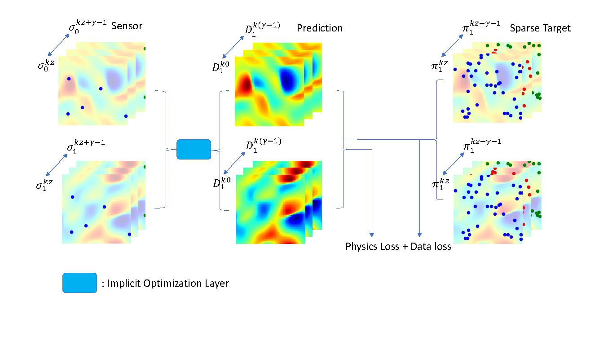

# Energy Network for State Estimation with Random Sensors (ENSERS)
*Model for learning from spare training labels capable to predicting full states given varied no. of sensors at random locations.*

*Yash Kumara, Tushar, Souvik Chakraborty*

## Network architecture 



---

## Quick Start

### Burgers2D

1. Try Loading data and Test loss function  
    1.  cd ./src/Brugers2D/
        ```
        python Burgers2DLoadData.py
        python Burgers2DPhysicsLoss.py

2.  Run experiments
    1.  cd ./experiments/Burgers2D      
        ```
        python experBurgers2DEnsers.py
        python experResults.py
        ```
---
### FlowPastCylinder
1. Try Loading data and Test loss function  
    1.  cd ./src/FlowPastCylinder/
        ```
        python FlowPastCylinderLoadData.py
        python FlowPastCylinderPhysicsLoss.py
        ```

3.  Run experiments
    1.  cd ./experiments/FlowPastCylinder      
        ```
        python experFlowPastCylinderEnsers.py
        python experResults.py
        ```
---

##  Brugers2D Simulation
cd ./src/Brugers2D/solver
```
make buildimage
make container
python3 fenics_burgers2d_periodic.py
exit
make rmcontainer
```

<!-- ## Results
### 2D Burgers’ equation


### Flow Past Cylinder

 -->

